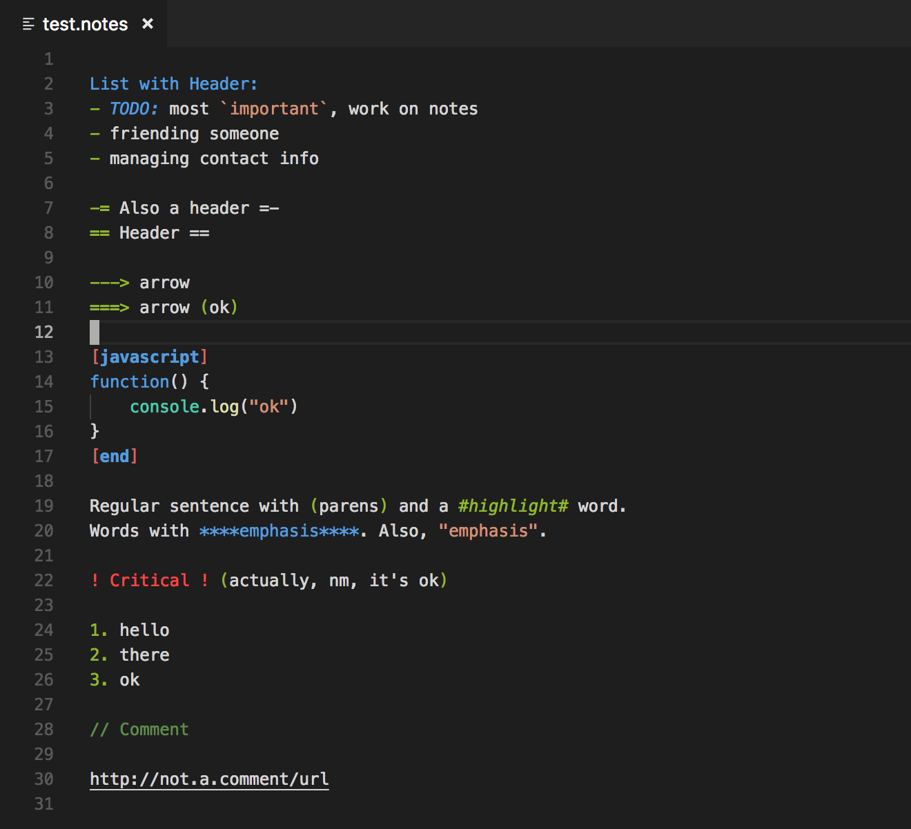

# Notes

## Features

Syntax highlighting for notes, with simple TODO lists. Based on [Sublime Text Notes](https://packagecontrol.io/packages/Notes) by tbh1.



## Snippets & Commands

A `newday` snippet includes the current date and a set of organizing section headings:
```
[2019-02-02]
Notes:
Ideas:
TODO:
Activity Log:
```

To add a new "TODO" item checkbox, use the `cmd+L` shortcut:
```
[ ] Pick up daughter after school
```

When the cursor is on a line with a TODO checkbox, subsequent `cmd+L` directives will cycle through `[√]` (done) and `[x]` (won't do).

## Configuration

You may want to configure some of the text colors, for instance in your vscode settings file (`Cmd+,` on Mac OS X), you can add scopes like so:

```
"editor.tokenColorCustomizations": {
    "textMateRules": [
        {
            "scope": "keyword.operator.notes",
            "settings": {
                "foreground": "#92b630"
            }
        },
        {
            "scope": "variable.language.notes",
            "settings": {
                "foreground": "#92b630",
                "fontStyle": "italic"
            }
        }
    ]
}
```

Some of the scopes you can configure are as follows:

```
keyword.operator.notes
keyword.other.notes
variable.language.notes
entity.name.tag.notes
comment.notes
string.quoted.single.notes
string.quoted.double.notes
invalid.deprecated.notes
```

Other scopes are language-specific.

## Release Notes

See [CHANGELOG.md](CHANGELOG.md).